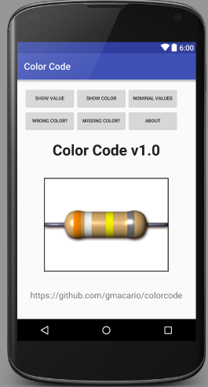

# Color Code

Color Code is an Android App developed by [Gianpaolo Macario](https://gmacario.github.io/)
as final project for the [Android Study Jam](http://android-studyjam.eventbrite.it/) organized by [GDG Torino](https://www.facebook.com/gdgtorino) in March 2016.

Getting started
===============

Download [Android Studio](http://developer.android.com/sdk/index.html) 2.0 for Windows.

Install Android Studio on your laptop.

Start Android Studio, then **Check out project from Version Control** > **Git**

> Clone Repository
>
> * Git Repository URL: `https://github.com/gmacario/colorcode`
> * Parent Directory: `C:\Users\gmacario\AndroidStudioProjects`
> * Directory Name: `colorcode`

then click **Clone**.

Inside Android Studio: **Build** > **Make Project**

Inside Android Studio: **Run** > **Run 'app'**

Select Deployment target (choose Emulator `Nexus 5 API 23 x86`), then click **OK**.

The Idea
========

The “[Color Code](https://github.com/gmacario/colorcode)” project is an educational Android app which provides five ways to learn how to read and memorize color code of resistors.

### The Target User

A young student who is attempting at learning electrical engineering, or just recognizing the different resistors of his brand new [Arduino Starter Kit](http://www.arduino.cc/en/Main/ArduinoStarterKit).

Persona: Filippo (my younger kid).

### Information needed by the target user

Quick way for learning (and remembering) how to convert color stripes painted on a resistor to actual value of resistance (incl. tolerance).

Maybe use a game to help memorizing.

### The Functions

1. Select colors, print the resistance value and tolerance
2. Type resistance, display color stripes
3. Select decade and tolerance, print nominal resistance ranges
4. Game: Find the wrong color
5. Game: Fill in the missing color

The Design of the App
=====================

See [App Design (PDF)](colorcode-design-20160413-1656.pdf).

Known issues and limitations
============================

1. The App does not do anything really useful right now
1. Only Emulated target is supported. You may try running the app on your mobile phone connected via ADB, Your Mileage May Vary

Contributing to Color Code
==========================

[Pull Requests](https://github.com/gmacario/colorcode/pulls) are welcome!

Licensing
=========

Copyright 2016, [Gianpaolo Macario](https://gmacario.github.io/).

Color Code is licensed under the Apache License, Version 2.0. See
[LICENSE](https://github.com/gmacario/colorcode/blob/master/LICENSE) for the full
license text.

<!-- EOF -->
